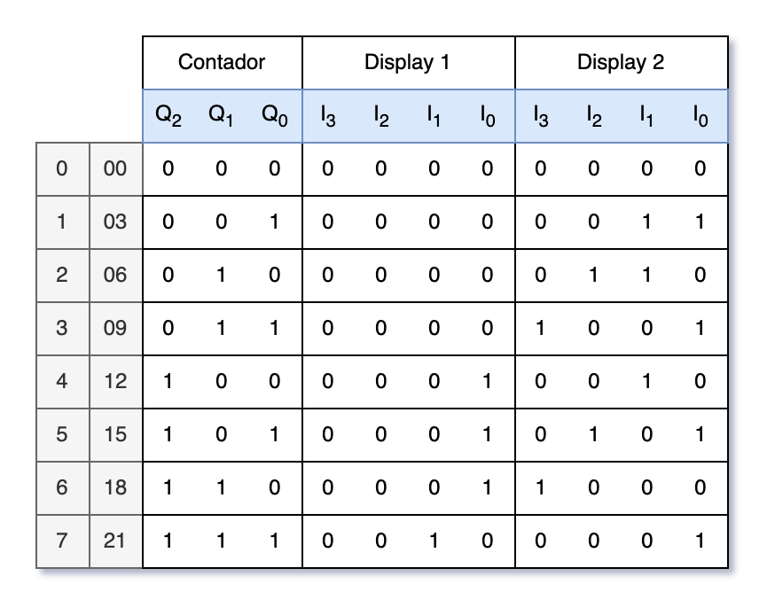

### (2024-2C) Sistemas Digitales I
# Trabajo Práctico Final

## Grupo 1

### Integrantes

| Nombre y apellido | Legajo  |
|-------------------|---------|
| Gaston Gomez      |         |
| Jimena Medina     |         |
| Tatiana Flores    | 0148935 |
| Mauro Escudero    | 0085840 |

 
\newpage 

# Consigna

Diseñar un contador que vaya de tres en tres, que inicie la secuencia en 0 y por cada pulso de reloj aumente la cuenta de a tres hasta llegar a 21, y vuelva a empezar (0,3,6,9,12,15,18,21,0…). El resultado del contador debe luego mostrarse en dos display 7 segmentos. Se deben utilizar flip flops JK.

# Desarrollo

Ya que solamente nos interesa representar 8 estados, se tomó la decisión de implementar un contador de 3 bits (con flip flops JK) que permitan representar: 0, 1, 2, 3, 4, 5, 6, y 7, para luego mediante compuertas lógicas poder interpretarlos como 0, 3, 6, 9, 12, 15, 18 y 21.

#### Estados
Se definen los 8 estados posibles, los cuales requieren de 3 bits para ser representados:

 
\newpage 

#### Tabla de verdad de flip flops JK
Por lo tanto se necesitan 3 flip flops JK para poder representar los 8 estados, 
Se define la tabla de verdad junto a los estados actuales y futuros de estos:

#### Mapas de Karnaugh de flip flops JK
Se decide utilizar mapas de Karnaugh para obtener las expresiones mínimas para las entradas J y K de los tres flip flops:

 
\newpage 

#### Tabla de verdad de displays
Se continua con la definición de la tabla de verdad para las entradas de los displays, 
En estas tablas se define la lógica de interpretar los estados 0, 1, 2, 3, 4, 5, 6 y 7 como los múltiplos de tres 0, 3, 6, 9, 12, 15, 18 y 21. 
Ya que necesitamos visualizar números de dos dígitos se deben utilizar dos displays, uno que muestre el primer dígito y otro para el segundo:

 
\newpage 

#### Mapas de Karnaugh de displays
Se decide utilizar mapas de Karnaugh para obtener las expresiones mínimas para las entradas de los displays:

 
\newpage 

#### Simulador de circuitos
Se implementa el circuito en Falstad y se comprueba su correcto funcionamiento:
[Ver diagrama en Falstad](https://tinyurl.com/273zrqsv) 

 
\newpage 

#### Diagrama temporal
Se comprueba mediante un diagrama temporal que la transición de estados sea correcta: 

 
\newpage 

#### Implemetación en Tinkercad
Se implementa el circuito en Tinkercad:
[Ver en Tinkercad](https://www.tinkercad.com/things/bWCQsWBWqhy-tp-final-sdigitales-i?sharecode=2RiqZlfTIq9cOMa1QcFSS3Z2ZqUFGHzuoZx1kqbJ07Q)

Detalle de colores:
- Conexiones TIERRA --> negro
- Conexiones FUENTE --> rojo
- Conexiones del decodificador al display --> blanco
- Entradas al decodificador --> gris
- JO = Q0' --> verde
- KO = Q0 --> morado
- Q1' --> rosa
- Q1 --> amarillo 
- J1 --> turquesa
- K1 = K2 = J2 --> azul
- Q2 --> marron
- Q2' --> naranja
- Otras entradas y las salidas de compuertas --> blanco